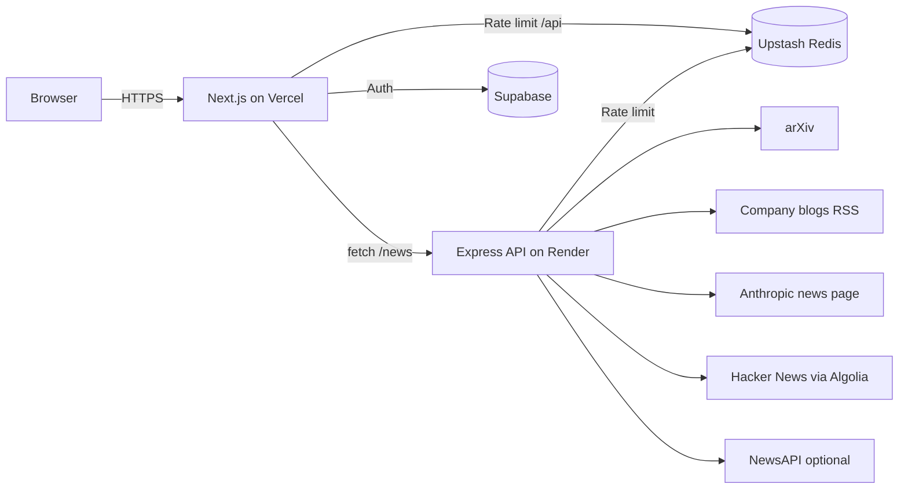

# 📰 AI News Live

### One live feed for everything happening in AI: research papers, company blogs, and community buzz, filtered and categorized automatically.

[](https://ai-news-live-gray.vercel.app)
[](https://ai-news-live.onrender.com/health)

[**Live Demo**](https://ai-news-live-gray.vercel.app) · [**API Health**](https://ai-news-live.onrender.com/health) · [**News Endpoint**](https://ai-news-live.onrender.com/news)

</div>

---

## ✨ Why this exists

AI news is scattered across arXiv, a dozen company blogs, Hacker News and newsletters. **AI News Live** pulls it all into a single, fast, filterable feed. It fetches on the server, validates every item, removes duplicates, tags each story with a topic category, and serves it through a clean Next.js interface.

> The first request to the backend can take up to a minute because it runs on Render's free tier, which sleeps when idle. An uptime ping against `/health` keeps it warm.

## 🚀 Features

- **Multi-source aggregation**: arXiv papers, company blogs, Hacker News and (optionally) NewsAPI in one stream.
- **Automatic categorization**: a keyword scoring engine tags stories as `LLM`, `Robotics`, `Ethics` or `General`.
- **Filters**: narrow the feed by source type (blog, community, research, news) and by category.
- **Resilient scraping**: browser-like headers, XML validation, per-feed timeouts, and a failure in one source never takes down the others.
- **Strict data validation**: every item passes a Zod schema (`safeParse`), and invalid items are dropped and logged instead of crashing the pipeline.
- **De-duplication and sorting**: duplicate URLs are removed and the newest stories come first.
- **Authentication**: sign up and log in with Supabase Auth, including email confirmation.
- **Rate limiting**: Upstash Redis protects the API from abuse.
- **ISR caching**: the home page revalidates hourly, and the client refreshes data with SWR.
- **Split deployment**: the frontend runs on Vercel and the backend on Render, each deploying automatically on every push to `main`.

## 🧱 Architecture



**Backend pipeline** (`backend/src/scrapers/consolidate.ts`):

1. Run all scrapers in parallel (`blogs`, `community`, `arxiv`, `news`).
2. Categorize every item still tagged `General` using title and summary.
3. Drop duplicate URLs.
4. Validate each item against the Zod schema.
5. Sort by `publishedAt`, newest first.

## 📡 Data sources

| Type | Source | Method |
|---|---|---|
| Research | arXiv | API |
| Blog | OpenAI | RSS |
| Blog | Google DeepMind | RSS |
| Blog | Hugging Face | RSS |
| Blog | NVIDIA | RSS |
| Blog | AWS Machine Learning | RSS |
| Blog | Anthropic | HTML scrape (no official RSS) |
| Community | Hacker News | Algolia search API, posts above 10 points |
| News | NewsAPI | REST API, optional (needs a key) |

Each blog feed is capped at the newest 10 items so no single publisher floods the feed.

## 🧠 How categorization works

`backend/src/lib/categorize.ts` scores each story against keyword patterns for three topics:

- **Title match** counts 3 points and **summary match** counts 1 point.
- The highest score wins, and ties are broken in the order **Ethics → Robotics → LLM**.
- If nothing matches, the story stays `General`.
- Patterns are plural-safe (`LLM` and `LLMs` both match) and deliberately avoid ambiguous words such as `policy`, `diffusion` and `token`, which caused false positives in testing.

Quick test from the `backend` folder:

```bash
npx ts-node -e "import { categorize as c } from './src/lib/categorize'; console.log(c('New LLMs improve reasoning'), c('Humanoid robot learns to grasp'), c('EU AI Act and copyright'), c('Quarterly earnings report'))"
# LLM Robotics Ethics General
```

## 🛠️ Tech stack

| Layer | Technology |
|---|---|
| Frontend | Next.js 16 (App Router, Turbopack), React, TypeScript, Tailwind CSS, SWR |
| Backend | Node.js, Express, TypeScript, `rss-parser`, `cheerio`, Zod |
| Auth and DB | Supabase |
| Rate limiting | Upstash Redis (REST) |
| Hosting | Vercel (frontend), Render (backend) |

## 📁 Project structure

```
ai-news-live/
├── src/                          # Next.js frontend
│   ├── app/
│   │   └── page.tsx              # Server component, ISR, fetches /news
│   ├── components/feed/
│   │   ├── Feed.tsx              # Filters + SWR data fetching
│   │   └── NewsCard.tsx          # Single story card
│   ├── lib/
│   │   ├── config.ts             # BACKEND_URL
│   │   └── types.ts
│   └── middleware.ts             # Rate limit + CORS for /api/*
├── backend/                      # Express API (deployed separately)
│   └── src/
│       ├── index.ts              # Routes: /news, /health
│       ├── scrapers/
│       │   ├── blogs.ts
│       │   ├── community.ts
│       │   ├── arxiv.ts
│       │   ├── news.ts
│       │   └── consolidate.ts
│       └── lib/
│           ├── categorize.ts
│           ├── validation.ts
│           ├── fetch-utils.ts
│           └── types.ts
├── next.config.ts
└── tsconfig.json
```

## 🔌 API

| Method | Route | Description |
|---|---|---|
| `GET` | `/news` | Consolidated, categorized, de-duplicated feed (rate limited) |
| `GET` | `/health` | Returns `OK`, suitable for uptime monitors |

Example item:

```json
{
  "id": "hn-123456",
  "title": "Example story",
  "summary": "120 points, 45 comments on Hacker News",
  "url": "https://example.com/story",
  "source": "community",
  "sourceName": "Hacker News",
  "publishedAt": "2026-10-08T06:30:00.000Z",
  "category": "LLM",
  "engagement": 120
}
```

`source` is one of `blog | community | research | news`, and `category` is one of `LLM | Robotics | Ethics | General`.

## ⚙️ Getting started

### Prerequisites

- Node.js 20+
- A Supabase project (free)
- An Upstash Redis database (free)
- Optional: a NewsAPI key

### 1. Clone and install

```bash
git clone https://github.com/Ajzel/ai-news-live.git
cd ai-news-live
npm install
cd backend && npm install && cd ..
```

### 2. Environment variables

Create `.env.local` in the repo root (frontend) and `backend/.env` (backend). **Never commit these files.**

**Frontend (`.env.local`)**

```env
NEXT_PUBLIC_SUPABASE_URL=https://<your-project>.supabase.co
NEXT_PUBLIC_SUPABASE_ANON_KEY=<your Supabase publishable key>
NEXT_PUBLIC_BACKEND_URL=http://localhost:3001
UPSTASH_REDIS_REST_URL=<upstash rest url>
UPSTASH_REDIS_REST_TOKEN=<upstash rest token>
ALLOWED_ORIGINS=*
```

**Backend (`backend/.env`)**

```env
UPSTASH_REDIS_REST_URL=<upstash rest url>
UPSTASH_REDIS_REST_TOKEN=<upstash rest token>
NEWS_API_KEY=<optional>
ALLOWED_ORIGINS=*
PORT=3001
```

> Use only the Supabase **publishable** key in the frontend, never a secret key. Use the Upstash **REST** URL and token, not a `redis://` connection string.

### 3. Run locally

```bash
# Terminal 1: backend
cd backend
npm run dev

# Terminal 2: frontend (repo root)
npm run dev
```

Open http://localhost:3000.

### 4. Build

```bash
npm run build               # frontend
cd backend && npm run build # backend (tsc)
```

## ☁️ Deployment

The app deploys as two services.

**Backend on Render**

| Setting | Value |
|---|---|
| Root Directory | `backend` |
| Build Command | `npm install && npm run build` |
| Start Command | `npm run start` |
| Env vars | `UPSTASH_REDIS_REST_URL`, `UPSTASH_REDIS_REST_TOKEN`, `NEWS_API_KEY`, `ALLOWED_ORIGINS` |

**Frontend on Vercel**

| Setting | Value |
|---|---|
| Root Directory | `./` |
| Framework | Next.js |
| Env vars | `NEXT_PUBLIC_SUPABASE_URL`, `NEXT_PUBLIC_SUPABASE_ANON_KEY`, `NEXT_PUBLIC_BACKEND_URL`, `UPSTASH_REDIS_REST_URL`, `UPSTASH_REDIS_REST_TOKEN`, `ALLOWED_ORIGINS` |

**Recommended order:** deploy the backend first, then the frontend, then tighten `ALLOWED_ORIGINS` on both to your Vercel domain (no trailing slash).

**Supabase Auth settings:** set the Site URL to your Vercel domain and add `https://<your-domain>/**` and `http://localhost:3000/**` under Redirect URLs.

**Uptime monitoring:** point your monitor at `https://<your-backend>/health` with an interval under 15 minutes to keep the free Render instance awake.

## 🧯 Lessons learned along the way

Real problems solved while building this, for anyone doing a similar split deploy:

- **Next.js 16 removed `request.ip`**: read the `x-forwarded-for` header in middleware instead.
- **Build-time fetch crashes**: wrap server-side fetches in `try/catch` and return `[]` so prerendering survives an unreachable backend.
- **Dates arrive as strings over JSON**: wrap in `new Date(...)` before calling date methods.
- **Monorepo type checking**: exclude `backend` in the root `tsconfig.json` so Vercel doesn't type-check Express code.
- **Reddit blocks cloud IPs**: the Reddit source was dropped in favor of the Hacker News API.
- **Scrapers must not trust responses**: validate that "XML" is actually XML, since cloud hosts often get bot-check HTML.
- **One bad item shouldn't wipe a source**: use Zod `safeParse` and filter, never `parse` and throw.

## ⚠️ Known limitations

- Anthropic has no official RSS feed, so its news page is scraped. This can break if the page markup changes, and the connection can be blocked from some cloud networks.
- Categorization is keyword-based. It is fast and transparent, but it will misclassify some edge cases.
- The free Render tier has cold starts after idle periods.

## 🗺️ Roadmap

- [ ] Migrate `middleware.ts` to the Next.js 16 `proxy.ts` convention
- [ ] Reliable Anthropic ingestion (scheduled job or alternate relay)
- [ ] LLM-based classifier as an upgrade over keyword scoring
- [ ] Bookmarks and saved filters for logged-in users
- [ ] Vercel Web Analytics
- [ ] Row Level Security on all Supabase tables

## 🔒 Security notes

- `.env` files are git-ignored. Verify with `git ls-files .env .env.local`, which should print nothing.
- Only publishable and public keys are exposed to the browser.
- The Upstash token and NewsAPI key live only in the Render and Vercel dashboards.
- CORS is restricted through `ALLOWED_ORIGINS` in production.

## 👤 Author

**Mohammed Ajzel *, AI/ML engineer, Bangalore, India

[](https://github.com/Ajzel)

---


If you find this useful, consider giving it a ⭐
